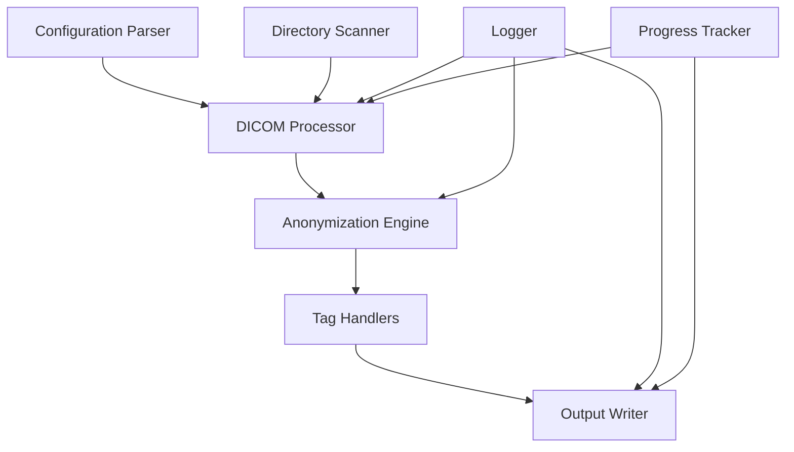
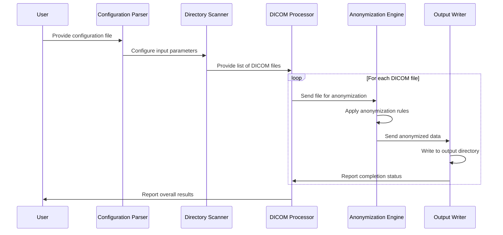
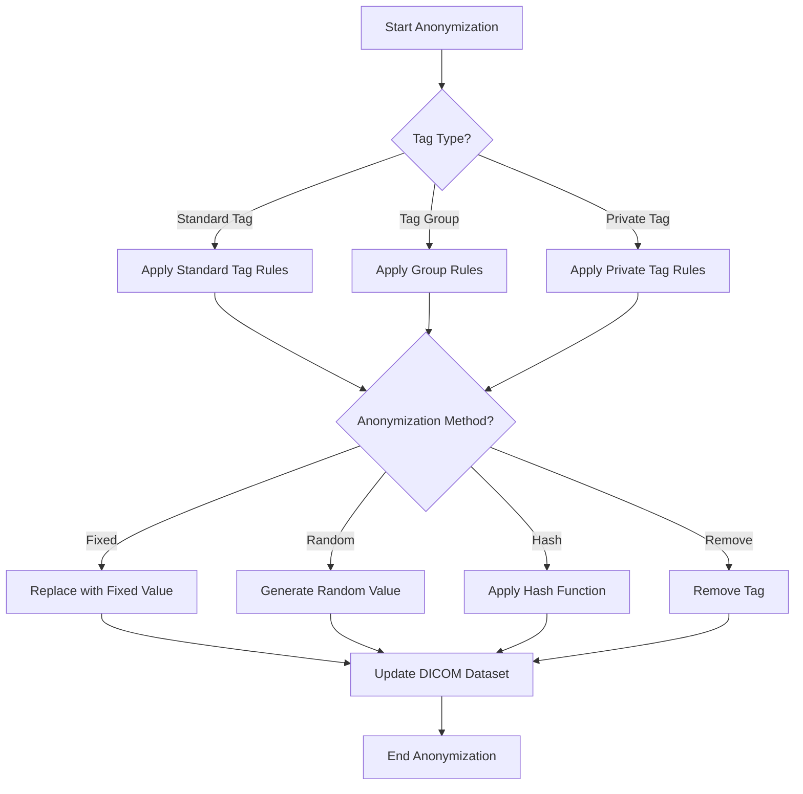

# DICOM Anonymization Tool Design Plan

## 1. Overview

We'll create a configurable Python tool that can anonymize DICOM files by creating new copies with modified tags in a separate output directory. The tool will support various anonymization methods, handle nested directory structures, and provide comprehensive logging and progress tracking.

## 2. Technical Stack

- **Python**: Version 3.8+ for modern language features
- **pydicom**: For DICOM file manipulation (recommended as it's the most mature, well-documented library with good support for tag manipulation including private tags)
- **pyyaml/json**: For configuration file parsing
- **tqdm**: For progress tracking
- **logging**: Python's built-in logging module for comprehensive logging
- **pathlib**: For cross-platform path handling
- **concurrent.futures**: For potential parallel processing of files

## 3. Architecture



## 4. Core Components

### 4.1 Configuration System
- **Purpose**: Define which tags to anonymize and how to anonymize them
- **Features**:
  - YAML/JSON configuration file support
  - Specification of standard tags, tag groups, and private tags
  - Multiple anonymization methods per tag
  - Input/output directory configuration
  - Logging level configuration

Example configuration structure:
```yaml
input:
  directory: "/path/to/input"
  recursive: true

output:
  directory: "/path/to/output"
  preserve_structure: true

logging:
  level: "INFO"
  file: "anonymization.log"

anonymization:
  standard_tags:
    - tag: "PatientName"
      method: "fixed"
      value: "ANONYMOUS"
    - tag: "PatientID"
      method: "hash"
      salt: "custom-salt"
  
  tag_groups:
    - group: "Patient"
      method: "fixed"
      value: "ANONYMOUS"
      exceptions: ["PatientWeight", "PatientHeight"]
  
  private_tags:
    - group: "0x0009"
      creator: "GEMS_IDEN_01"
      method: "remove"
```

### 4.2 Directory Scanner
- **Purpose**: Scan input directories and identify DICOM files
- **Features**:
  - Recursive directory traversal
  - DICOM file validation
  - Preservation of directory structure in output

### 4.3 DICOM Processor
- **Purpose**: Coordinate the processing of DICOM files
- **Features**:
  - Read DICOM files using pydicom
  - Apply anonymization rules
  - Write anonymized files to output directory
  - Track progress
  - Handle errors gracefully

### 4.4 Anonymization Engine
- **Purpose**: Apply anonymization methods to DICOM tags
- **Features**:
  - Support for multiple anonymization methods:
    - Fixed value replacement
    - Random value generation
    - Hashing (with configurable salt)
    - Removal of tags
    - Date shifting
  - Handle standard tags, groups, and private tags
  - Support for nested tags within sequences

### 4.5 Logging System
- **Purpose**: Provide comprehensive logging
- **Features**:
  - Configurable log levels
  - File and console logging
  - Detailed operation logging
  - Error reporting

### 4.6 Progress Tracking
- **Purpose**: Monitor and display anonymization progress
- **Features**:
  - File count and processing status
  - Estimated time remaining
  - Success/failure statistics

## 5. Implementation Plan

### 5.1 Project Structure
```
dicom_anonymizer/
├── __init__.py
├── __main__.py                # Entry point for command-line usage
├── config/
│   ├── __init__.py
│   ├── parser.py              # Configuration file parser
│   └── validator.py           # Configuration validation
├── core/
│   ├── __init__.py
│   ├── scanner.py             # Directory scanner
│   ├── processor.py           # DICOM file processor
│   └── writer.py              # Output file writer
├── anonymization/
│   ├── __init__.py
│   ├── engine.py              # Anonymization engine
│   ├── methods/               # Different anonymization methods
│   │   ├── __init__.py
│   │   ├── fixed.py
│   │   ├── random.py
│   │   ├── hash.py
│   │   └── remove.py
│   └── handlers/              # Tag type handlers
│       ├── __init__.py
│       ├── standard.py
│       ├── group.py
│       └── private.py
├── utils/
│   ├── __init__.py
│   ├── logging.py             # Logging utilities
│   └── progress.py            # Progress tracking utilities
└── examples/
    ├── basic_config.yaml      # Example configuration files
    └── advanced_config.yaml
```

### 5.2 Development Phases

1. **Phase 1: Core Framework**
   - Set up project structure
   - Implement configuration parsing
   - Create basic DICOM file processing pipeline
   - Implement directory scanning and output writing

2. **Phase 2: Anonymization Engine**
   - Implement basic anonymization methods (fixed, remove)
   - Add support for standard tags
   - Develop tag group handling
   - Add private tag support

3. **Phase 3: Advanced Features**
   - Implement advanced anonymization methods (hash, random)
   - Add support for nested tags in sequences
   - Implement comprehensive logging
   - Add progress tracking

4. **Phase 4: Testing and Optimization**
   - Create test suite with sample DICOM files
   - Optimize for performance
   - Add error handling and recovery
   - Validate anonymization effectiveness

5. **Phase 5: Documentation and Packaging**
   - Create comprehensive documentation
   - Add example configurations
   - Package for distribution
   - Create user guide

## 6. Key Algorithms and Workflows

### 6.1 Main Processing Workflow



### 6.2 Anonymization Rule Application



## 7. Error Handling and Edge Cases

- **Invalid DICOM files**: Detect and log files that aren't valid DICOM format
- **Missing tags**: Handle cases where specified tags don't exist in some files
- **Access permissions**: Handle permission errors for input/output directories
- **Disk space**: Check available space before processing large directories
- **Corrupt files**: Gracefully handle and log corrupt DICOM files
- **Interrupted processing**: Support resuming from interruptions

## 8. Performance Considerations

- **Parallel processing**: Use concurrent.futures for processing multiple files simultaneously
- **Memory management**: Process files one at a time to minimize memory usage
- **Progress reporting**: Provide accurate progress without impacting performance
- **Large datasets**: Optimize for handling large numbers of files efficiently

## 9. Security Considerations

- **Data protection**: Ensure original files are never modified
- **Anonymization validation**: Verify that all specified tags are properly anonymized
- **Logging security**: Ensure logs don't contain sensitive information
- **Configuration security**: Validate configuration to prevent injection attacks

## 10. Future Extensions

- **GUI interface**: Add a graphical user interface for easier configuration
- **Web service**: Expose as a REST API for remote processing
- **Batch processing**: Support for scheduled batch processing
- **Customizable plugins**: Allow custom anonymization methods via plugins
- **De-identification profiles**: Support for standard de-identification profiles (DICOM Basic, etc.)